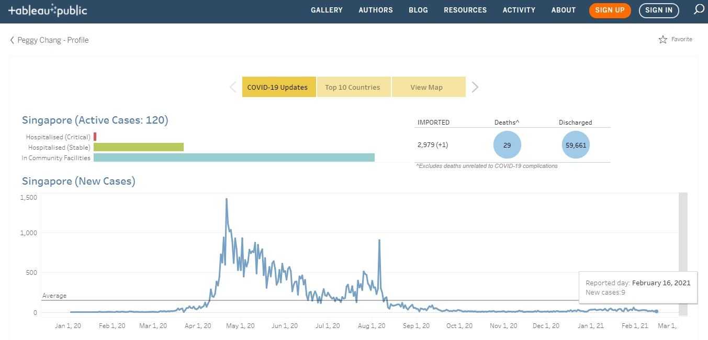

# Loading COVID-19 Data to Google Sheet
---

In this project, we read COVID-19 coronavirus data available from [World Health Organization](https://covid19.who.int/) and load it into Google Sheet, where this is one of the data sources used for a [data visualisation work](https://public.tableau.com/profile/peggy.chang#!/vizhome/COVID-19Updates_16082983614350/S1) created for COVID-19 updates on **Tableau Public**.

**Tool:**

To load COVID-19 data onto Google Sheet, we use [`pygsheets`](https://pygsheets.readthedocs.io/en/latest/) written by [Nithin Murali](https://github.com/nithinmurali/pygsheets). This is a simple, intuitive Python library to access Google spreadsheets through the Google Sheets API v4.

Although we can use the `importData()` function in Google Sheet itself to obtain data directly from a URL, there are some limitations and it would not work for large datasets.

**Pre-requisite:**

Before running the codes, we first need to go to [Google Developer Console](https://console.developers.google.com/) to enable the Google Drive API, create a service account and download the private key in a JSON file for account authorization.

We will also need to share the specific Google Sheet with the service account email address.

[Click here to view the details in this notebook](Project_WHO_GoogleSheet.ipynb).
